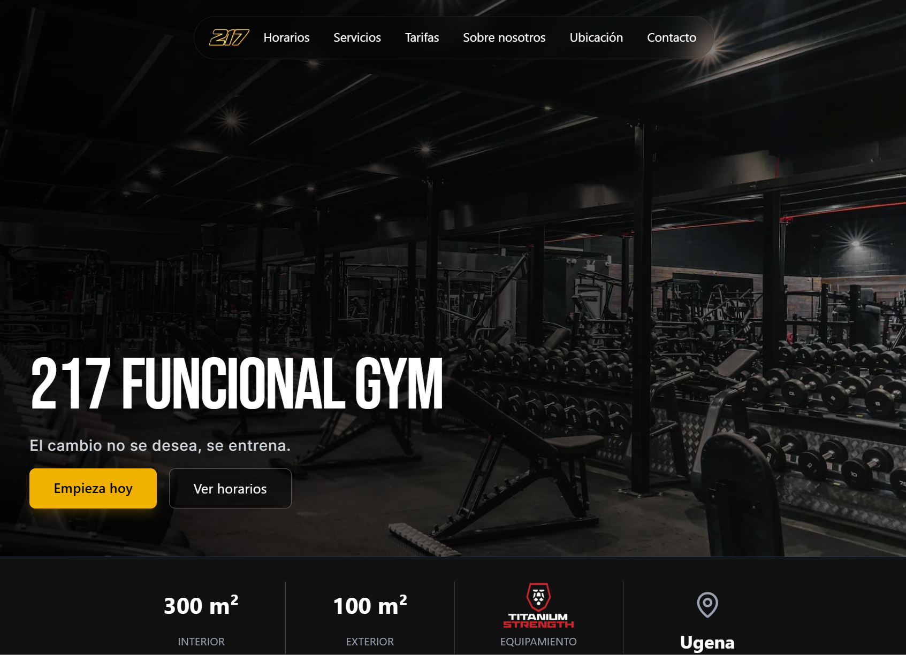

# 217 FUNCIONAL GYM 🏋️

Página web informativa para **217 Funcional GYM**, un gimnasio funcional real en Ugena (Toledo). Proyecto desarrollado como freelance para clientes reales.

🔗 **Demo en vivo:** [217funcionalgymdemo.netlify.app](https://217funcionalgymdemo.netlify.app)

## Sobre el proyecto

Web 100% informativa (sin backend ni base de datos) que incluye horarios, tarifas, servicios, ubicación con mapa y contacto. El formulario de contacto abre WhatsApp directamente, sin enviar datos a ningún servidor.

## Stack

- **React 19** + **TypeScript**
- **Vite**
- **Tailwind CSS v4**
- **Framer Motion** (con `LazyMotion` para reducir el bundle)
- **React Router v7**

## Características

- ⚡ Rendimiento optimizado: lazy loading de rutas, preload de imagen crítica (LCP), chunk preloading en idle
- ♿ Accesibilidad: 100/100 en Lighthouse
- 🔍 SEO: metadatos por página, Schema.org LocalBusiness, sitemap.xml, robots.txt — 100/100 en Lighthouse
- 📱 Diseño responsive con animaciones (respeta `prefers-reduced-motion`)
- 🍪 Gestión de consentimiento de cookies para el mapa embebido

## Resultados Lighthouse (mobile)

| Métrica          | Puntuación |
| ---------------- | ---------- |
| Accesibilidad    | 100        |
| Buenas prácticas | 100        |
| SEO              | 100        |
| Rendimiento      | 83\*       |

\*El margen de rendimiento se debe a fotos de stock temporales, pendientes de sustituir por fotografías reales del gimnasio.

## Desarrollo local

\`\`\`bash
npm install
npm run dev
\`\`\`
